# Writeup CTF1 - Introduction

### Préparer la CTF
TryHackMe met à disposition un service de VPN pour être sur un réseau qui peut communiquer avec les machines cibles. Vous pouvez aller télécharger votre fichier d'authentification dans votre profil TryHackMe.\
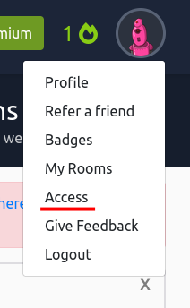\
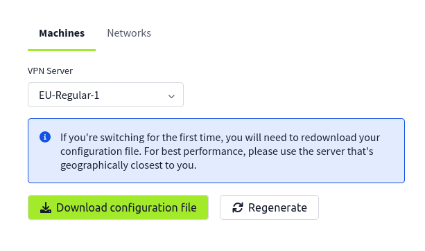\
Ensuite, le service à utiliser est **openvpn** et la commande à effectuer est :
```
sudo openvpn /path/to/vpn_config.ovpn
```

### Lancer la machine
Après avoir lancé la machine, il faut attendre quelques minutes avant qu'elle soit bien initialisée et que tous les services soient lancés.\
Pour vérifier si la machine est prête, exécutez la commande :
```
ping <ip de la machine>
```

### Première reconnaissance
L'outil utilisé pour scanner les ports ouverts de la machine cible est **nmap**\
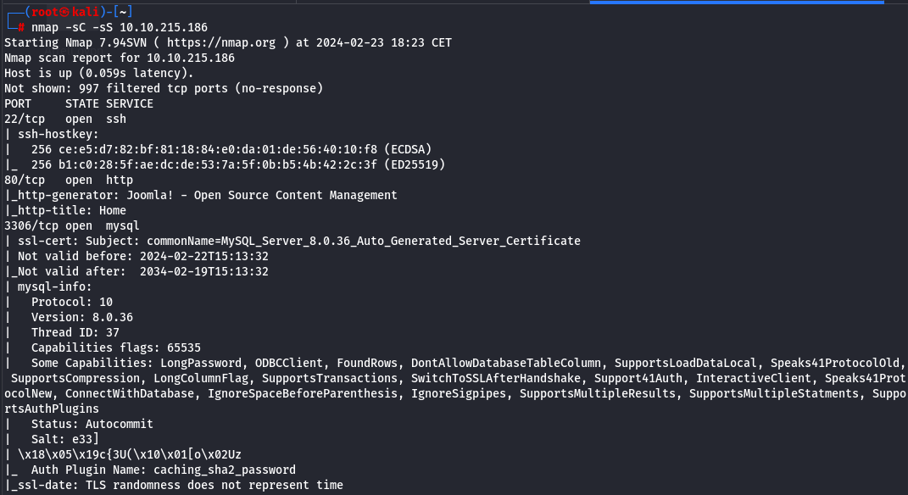\
On remarque que les ports **22,80,3306** sont ouverts.\
Pour l'instant le seul port intéressant est le port 80 car SSH et MySQL nécessitent un nom d'utilisateur et un mot de passe.\
On entre donc l'ip de la machine sur un navigateur et on arrive sur une application web avec le titre **cassiopeia**.\
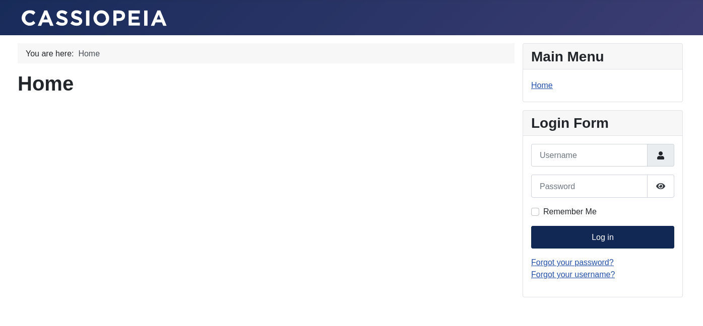

### Premier exploit
On utilisera dirb dans cet exemple.\
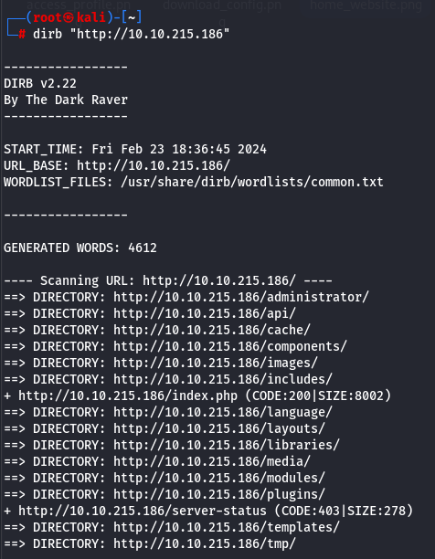\
On remarque le chemin **/administrator** qui renvoie vers une page de connexion au service **joomla**.\
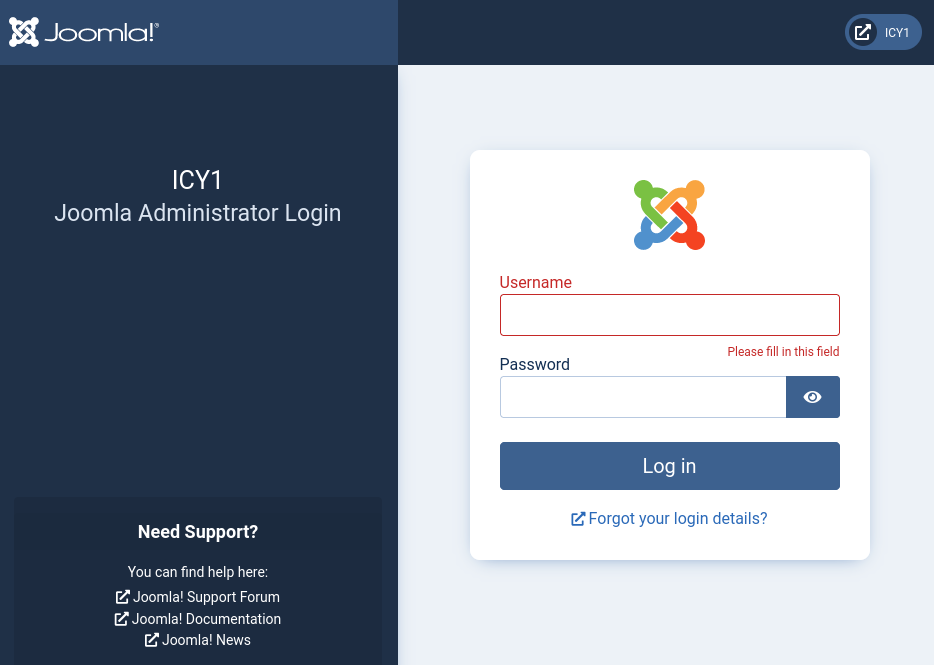\
Pour récupérer la version de Joomla, on se rend à l'adresse _/administrator/manifests/files/joomla.xml_ :\
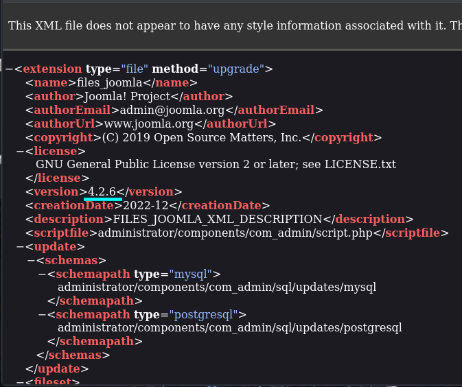\
La version de Joomla est **4.2.6**, en cherchant "joomla 4.2.6 exploit" sur un moteur un recherche, on trouve directement la **CVE-2023-23752**. Le [premier lien]("https://github.com/Acceis/exploit-CVE-2023-23752") est un lien github mettant à disposition un script ruby pour exploiter la vulnérabilité. Cependant, un outil connu pour exploiter des vulnérabilité facilement est **metasploit**. \
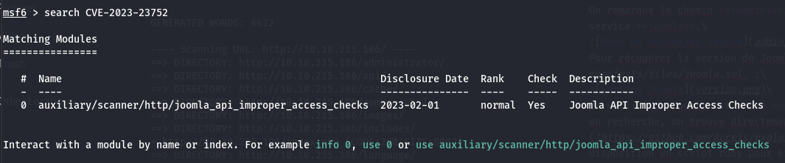\
On trouve bien la vulnerabilité dans la console mestasploit.

### Accès à la base de donnée
Cette vulnérabilité permet à un utilisateur non-authentifié d'accéder à des variables de configurations de Joomla, notamment celles contenants les informations de connexion à la base de donnée.\
On va donc paramétrer metasploit pour exploiter la vulnérabilité sur le site :\
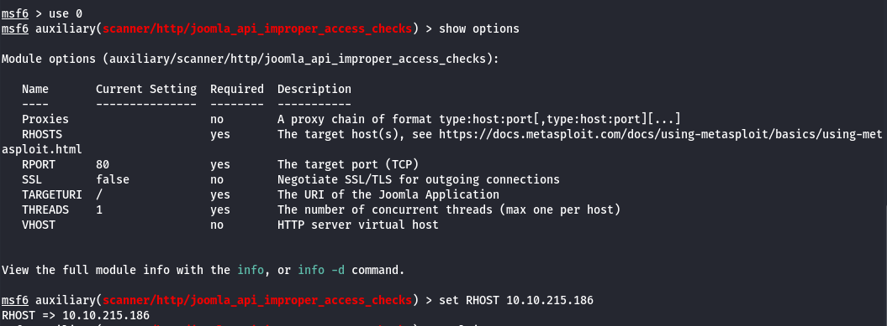\
On peut ensuite lancer l'exploit :\
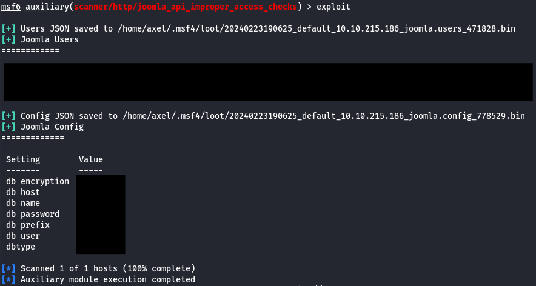\
On retrouve toutes les variables de configuration pour l'accès à la base de donnée\
Le scan nmap nous avait indiqué que la base de donnée écoutait les connexions sur le port 3306, qui est le port par défaut, donc on peut s'y connecter à distance avec la commande :
```
mysql -u <db user> -p -h <ip machine> <db name>
```
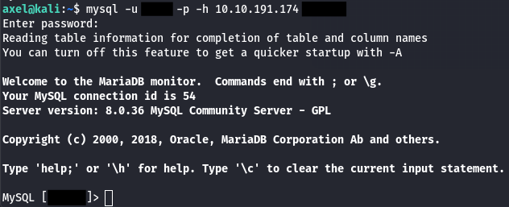\


